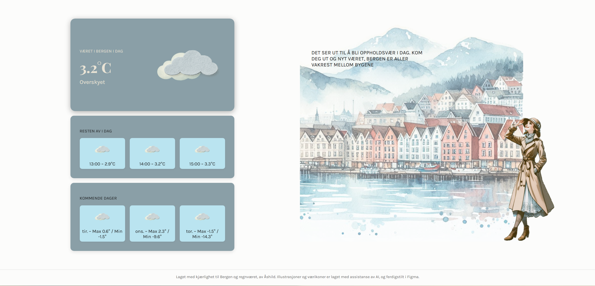

#  Bergen Weather App 

  

 

##  Konsept

Målet var å utforske hvordan funksjonell informasjon kan kombineres med et visuelt uttrykk som skaper personlighet og lokal tilhørighet.

I stedet for å bare vise værdata, ønsket jeg å:
- Gi brukeren en følelse av stemning.
- Skape visuell variasjon gjennom sesonger og vær.
- La illustrasjoner og tekst reagere dynamisk på faktiske værkoder.

   

##   Funksjoner
- Viser dagens vær med temperatur, beskrivelse og ikon.  
- Prognoser for både timer og dager fremover.  
- Illustrasjoner og figurer generert med AI, videreutviklet og raffinert i Figma.
- SVG-baserte figurer som tilpasser antrekk etter værforhold.
- Personlige værmeldinger knyttet til ulike værkoder.  
- Responsivt design.

 

##   Teknologi
- **Frontend:** HTML, CSS, JavaScript
- **API:** MET Norway Weather API
- **Designprosess:** AI-genererte illustrasjoner, videre bearbeidet i Figma
- **Grafikk:** SVG-illustrasjoner for fleksibel og skalerbar visning

 

##  Illustrasjoner

Alle illustrasjoner er generert med AI og videreutviklet og raffinert i Figma.
 

  
  
  

 

##  Hva jeg lærte

- Hvordan koble designvalg direkte til dynamiske data
- Strukturering av API-respons og håndtering av værkoder
- Hvordan SVG kan brukes for å skape mer levende og fleksible UI-elementer
- Viktigheten av visuell konsistens i små detaljer

 

##  Videre utvikling

- Legge til flere værdata, søk på vær
- Mikroanimasjoner knyttet til værbilder
- Forbedret tilgjengelighet (ARIA og kontrastforhold)

 
 
